# PromptHub - AI 提示词资产管理库

PromptHub 是一个用于管理和共享 AI 提示词（Prompt）的全栈 Web 应用。它提供了用户认证（含刷新令牌和密码重置）、提示词的创建与编辑、分类管理、标签筛选、收藏、版本管理、变量填充、权限控制、分享链接（含密码保护和过期时间）、多人协作（viewer/editor 角色）、Excel 批量导入/导出等功能，支持 Docker 容器化部署和 CI/CD 自动化流水线。

## 目录

- [项目架构](#项目架构)
- [技术栈](#技术栈)
- [功能特性](#功能特性)
- [项目截图](#项目截图)
- [快速开始](#快速开始)
- [Docker 部署](#docker-部署)
- [API 接口文档](#api-接口文档)
- [数据模型](#数据模型)
- [前端组件说明](#前端组件说明)
- [开发指南](#开发指南)
- [测试](#测试)
- [CI/CD](#cicd)

## 项目架构

```
PromptHub/
├── backend/                        # 后端服务 (Python / FastAPI)
│   ├── __init__.py                 # 包初始化
│   ├── main.py                     # 应用入口 + 全部 API 路由
│   ├── database.py                 # 数据库连接与会话管理 (SQLite)
│   ├── models.py                   # SQLAlchemy ORM 数据模型
│   ├── schemas.py                  # Pydantic 请求/响应数据校验模型
│   ├── auth.py                     # JWT 认证、密码哈希、用户鉴权、令牌刷新
│   └── routers/                    # 路由模块（早期拆分残留，未使用）
├── frontend/                       # 前端应用 (React / TypeScript / Vite)
│   ├── src/
│   │   ├── main.tsx                # 应用入口
│   │   ├── App.tsx                 # 根组件（路由配置 + 认证守卫）
│   │   ├── api.ts                  # API 请求封装 + TypeScript 类型定义
│   │   ├── index.css               # 全局样式
│   │   ├── lib/utils.ts            # 工具函数（cn 类名合并）
│   │   ├── hooks/useApi.ts         # API 调用 Hook（自动注入 Token + 401 处理）
│   │   ├── contexts/AuthContext.tsx # 认证上下文（用户状态 + Token + 刷新令牌持久化）
│   │   ├── pages/
│   │   │   ├── LoginPage.tsx       # 登录页面
│   │   │   ├── RegisterPage.tsx    # 注册页面
│   │   │   ├── ForgotPasswordPage.tsx  # 忘记密码页面
│   │   │   ├── ResetPasswordPage.tsx   # 重置密码页面
│   │   │   └── SharedPromptPage.tsx    # 分享提示词访问页面
│   │   ├── components/
│   │   │   ├── Layout.tsx          # 主布局容器
│   │   │   ├── Header.tsx          # 顶部导航栏（搜索/新建/导入导出/用户信息）
│   │   │   ├── Sidebar.tsx         # 侧边栏（分类树/标签筛选/收藏切换）
│   │   │   ├── PromptGrid.tsx      # 提示词卡片网格
│   │   │   ├── PromptCard.tsx      # 提示词卡片（标题/摘要/标签/收藏/删除）
│   │   │   ├── PromptForm.tsx      # 创建/编辑表单（分类多选/标签/公开选项）
│   │   │   ├── PromptDetail.tsx    # 详情弹窗（版本选择/变量填充/复制/分享/协作）
│   │   │   ├── CategoryDialog.tsx  # 分类创建/编辑对话框
│   │   │   ├── DeleteCategoryDialog.tsx  # 删除分类确认对话框
│   │   │   ├── DeletePromptDialog.tsx    # 删除提示词确认对话框
│   │   │   ├── ImportDialog.tsx    # Excel 导入对话框
│   │   │   ├── ShareDialog.tsx     # 分享链接管理对话框
│   │   │   ├── CollaboratorDialog.tsx  # 协作者管理对话框
│   │   │   └── ui/                 # shadcn/ui 基础组件
│   │   └── test/                   # 前端测试
│   │       ├── setup.ts
│   │       ├── api.test.ts
│   │       ├── AuthContext.test.tsx
│   │       └── PromptForm.test.tsx
│   ├── Dockerfile                  # 前端 Docker 镜像（多阶段构建 + Nginx）
│   ├── nginx.conf                  # Nginx 反向代理配置
│   ├── vitest.config.ts            # Vitest 测试配置
│   ├── .eslintrc.cjs               # ESLint 配置
│   ├── vite.config.ts              # Vite 构建配置
│   ├── tailwind.config.js          # Tailwind CSS 配置
│   ├── tsconfig.json               # TypeScript 配置
│   └── package.json
├── tests/                          # 后端 pytest 测试
│   ├── conftest.py                 # 测试 fixtures
│   ├── test_auth.py
│   ├── test_prompts.py
│   ├── test_categories.py
│   ├── test_favorites.py
│   └── test_password_reset.py
├── screenshots/                    # 项目截图
│   ├── 首页.png
│   ├── 新建提示词.png
│   ├── 新建分类.png
│   ├── 搜索功能.png
│   ├── 标签筛选.png
│   ├── 登录界面.png
│   ├── 注册.png
│   ├── 忘记密码获取重置令牌.png
│   ├── 重置密码界面.png
│   ├── 重置密码成功后界面.png
│   ├── 分类目录功能.png
│   ├── 收藏功能.png
│   ├── 我的收藏界面.png
│   ├── 批量导入功能.png
│   ├── 批量导出功能.png
│   ├── 分享功能.png
│   ├── 创建分享链接.png
│   ├── 提示词分享界面.png
│   ├── 协作功能.png
│   └── 协作管理界面.png
├── .github/workflows/ci-cd.yml    # CI/CD 流水线配置
├── docker-compose.yml              # Docker Compose 编排
├── Dockerfile.backend              # 后端 Docker 镜像
├── pyproject.toml                  # Ruff Lint/Format 配置
├── requirements.txt                # Python 依赖
└── prompts.db                      # SQLite 数据库（运行后自动生成）
```

## 技术栈

### 后端

| 技术             | 版本      | 说明                                     |
| ---------------- | --------- | ---------------------------------------- |
| Python           | 3.12+     | 编程语言                                 |
| FastAPI          | 0.104.1   | 高性能异步 Python Web 框架               |
| Uvicorn          | 0.24.0    | ASGI 服务器，支持热重载                  |
| SQLAlchemy       | 2.0.39    | Python ORM，声明式映射（Mapped 风格）    |
| Pydantic         | 2.10.3    | 数据校验与 JSON 序列化（v2 语法）        |
| python-jose      | 3.3.0     | JWT Token 编解码（HS256 算法）           |
| passlib[bcrypt]  | 1.7.4     | 密码哈希（bcrypt 算法）                  |
| openpyxl         | 3.1.5     | Excel 文件读写（导入/导出）              |
| python-multipart | 0.0.6     | 处理 multipart 表单请求                  |
| SQLite           | -         | 轻量级文件数据库，零配置                 |
| Ruff             | -         | Python Lint + Format 工具                |
| pytest           | -         | 后端单元测试框架                         |

### 前端

| 技术                     | 版本      | 说明                              |
| ------------------------ | --------- | --------------------------------- |
| React                    | 18.2.0    | 声明式 UI 框架                    |
| React Router DOM         | 7.15.0    | 客户端路由（含路由守卫）          |
| TypeScript               | 5.2+      | JavaScript 类型超集               |
| Vite                     | 5.1.0     | 下一代前端构建工具                |
| Tailwind CSS             | 3.4.1     | 原子化 CSS 框架                   |
| Radix UI                 | 多版本    | 无障碍 Headless UI 组件库         |
| Lucide React             | 0.344.0   | 开源图标库                        |
| class-variance-authority | 0.7.0     | 组件变体样式管理                  |
| clsx + tailwind-merge    | -         | 条件类名与 Tailwind 类合并        |
| Vitest                   | 4.1.7     | 前端单元测试框架                  |
| Testing Library          | 16.3.2    | React 组件测试库                  |

### 部署

| 技术            | 版本  | 说明                          |
| --------------- | ----- | ----------------------------- |
| Docker          | -     | 容器化部署                    |
| Docker Compose  | -     | 多容器编排                    |
| Nginx           | 1.27  | 前端静态服务 + API 反向代理   |
| GitHub Actions  | -     | CI/CD 自动化流水线            |
| Node.js         | 20.x  | 前端构建环境                  |

## 功能特性

### 用户认证

- **用户注册** — 填写用户名、邮箱、密码创建账号，注册成功后自动登录
- **用户登录** — 通过邮箱 + 密码登录，后端返回 Access Token（60 分钟有效）和 Refresh Token（7 天有效）
- **令牌刷新** — 使用 Refresh Token 无感刷新 Access Token，避免频繁重新登录
- **密码重置** — 忘记密码时，通过邮箱请求重置令牌（30 分钟有效），使用令牌设置新密码
- **Token 鉴权** — 所有提示词相关 API 均需携带 Bearer Access Token，未认证返回 401
- **自动登出** — Token 过期或无效时，前端自动清除登录状态并跳转登录页
- **登录持久化** — Access Token、Refresh Token 和用户信息存储在 localStorage，刷新页面保持登录

### 提示词管理

- **创建提示词** — 填写名称、适用场景、内容、变量说明，选择分类、标签，设置是否公开
- **编辑提示词** — 所有者和 editor 角色协作者可编辑，内容变更时自动生成新版本
- **查看详情** — 弹窗展示提示词完整信息，支持版本切换查看历史内容
- **删除提示词** — 仅所有者可删除，操作前弹出确认对话框

### 分类管理

- **树形分类** — 支持多级嵌套分类（parent_id 自引用），侧边栏以树形结构展示
- **全局 + 私有** — 全局分类（`user_id=None`）所有用户可见，用户可创建私有分类
- **外部分类** — 公开提示词关联的其他用户分类也会显示，标记为外部分类并显示所有者
- **分类 CRUD** — 创建、编辑、删除分类，更新时校验循环引用
- **删除提升** — 删除分类时子分类自动提升一级（parent_id 继承）
- **分类筛选** — 按分类筛选提示词时，自动包含该分类下所有子分类的提示词

### 收藏功能

- **切换收藏** — 点击收藏按钮切换收藏状态（已收藏则取消，未收藏则添加）
- **收藏筛选** — 侧边栏提供"我的收藏"快捷筛选
- **收藏计数** — 提示词卡片和详情中展示收藏人数

### 标签分类

- **标签关联** — 为提示词关联多个已有标签
- **新建标签** — 在创建/编辑表单中直接输入新标签名称，回车即可添加
- **标签筛选** — 左侧边栏按标签过滤提示词列表
- **全局共享** — 标签为全局共享资源，无用户归属

### 分享链接

- **创建分享** — 为提示词生成唯一的分享链接（URL-Safe 随机 Token）
- **密码保护** — 可选设置访问密码，查看者需输入密码才能访问
- **过期时间** — 可选设置链接过期时间（小时），过期后无法访问（返回 410）
- **链接管理** — 所有者可查看、删除已创建的分享链接
- **免登录访问** — 分享链接无需登录即可访问，通过 `/shared/{token}` 路径查看

### 协作功能

- **添加协作者** — 提示词所有者可通过搜索用户名/邮箱添加协作者
- **角色管理** — 支持 viewer（只读）和 editor（可编辑）两种角色
- **权限控制** — viewer 可查看私有提示词，editor 还可编辑内容
- **协作者退出** — 协作者可自行退出，所有者可移除任意协作者
- **可见性扩展** — 被添加为协作者后，可看到所有者的私有提示词

### 全文搜索与排序

- 在顶部搜索框输入关键词，实时按标题和内容进行模糊匹配过滤
- 支持按创建时间、更新时间、标题、ID 排序（升序/降序）
- 搜索、标签筛选、分类筛选、收藏筛选可同时生效

### 分页

- **页码分页** — `page` + `page_size`（page 从 1 开始，默认 20 条/页，最大 100）
- **偏移分页** — `skip` + `limit`（limit 最大 100）
- 分页元信息通过响应头返回（`X-Total-Count`、`X-Page`、`X-Page-Size`、`X-Total-Pages`）

### 版本管理

- 每次编辑提示词内容时，系统自动保存一个新版本（版本号递增）
- 在详情弹窗中通过下拉框切换查看任意历史版本
- 选择"最新版本"可查看当前内容

### 变量填充与复制

- 自动识别提示词内容中的变量占位符（支持 `{{变量名}}` 和 `[变量名]` 两种格式）
- 在详情弹窗中为每个变量提供输入框，填入实际值
- 点击"复制"按钮时，自动将变量替换为实际值后复制到剪贴板
- 复制成功/失败均有 Toast 提示

### Excel 导入/导出

- **导出** — 一键导出当前用户所有提示词为 Excel 文件（.xlsx）
- **导入模板** — 下载包含填写说明的 Excel 导入模板
- **批量导入** — 上传 Excel 文件批量导入提示词，自动创建不存在的分类和标签
- 导入结果返回成功导入数量和跳过数量

### 权限控制

- **私有提示词** — 默认创建为私有，仅创建者和协作者可见
- **公开到团队** — 勾选"公开到团队"后，所有用户可见该提示词
- **所有权校验** — 编辑和删除操作校验 `user_id`，非所有者返回 403
- **协作者编辑** — editor 角色协作者可编辑提示词内容，viewer 只能查看
- **可见范围** — 提示词列表返回当前用户的私有提示词 + 协作提示词 + 所有公开提示词

## 项目截图

### 首页与登录注册

| 首页 | 登录 | 注册 |
|:---:|:---:|:---:|
| 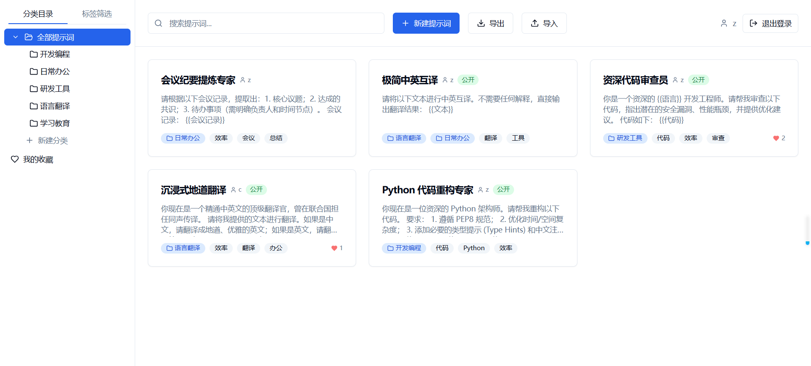 | 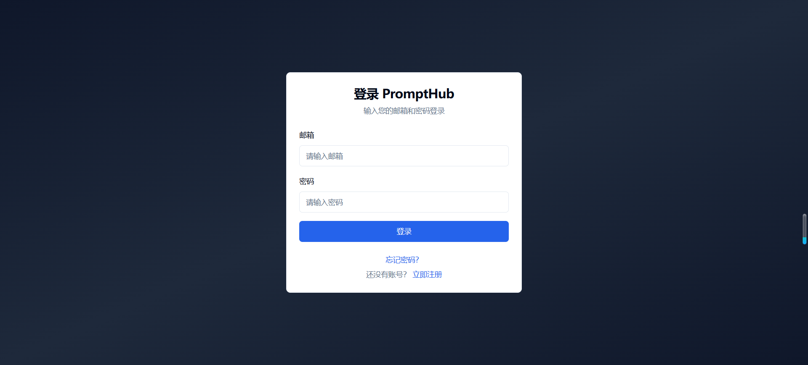 | 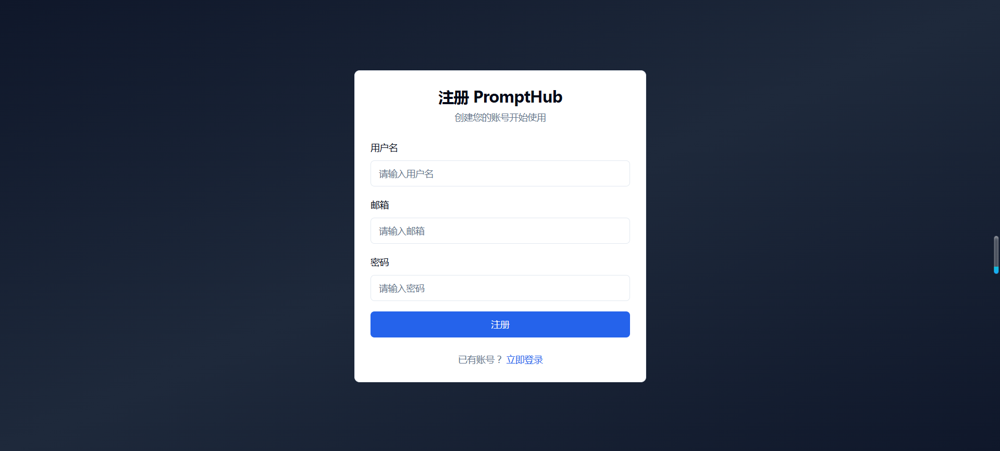 |

### 密码重置

| 忘记密码 | 重置密码 | 重置成功 |
|:---:|:---:|:---:|
|  |  |  |

### 提示词管理

| 新建提示词 | 搜索功能 |
|:---:|:---:|
| 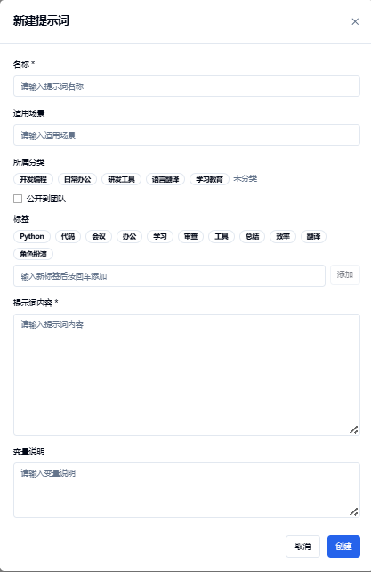 | 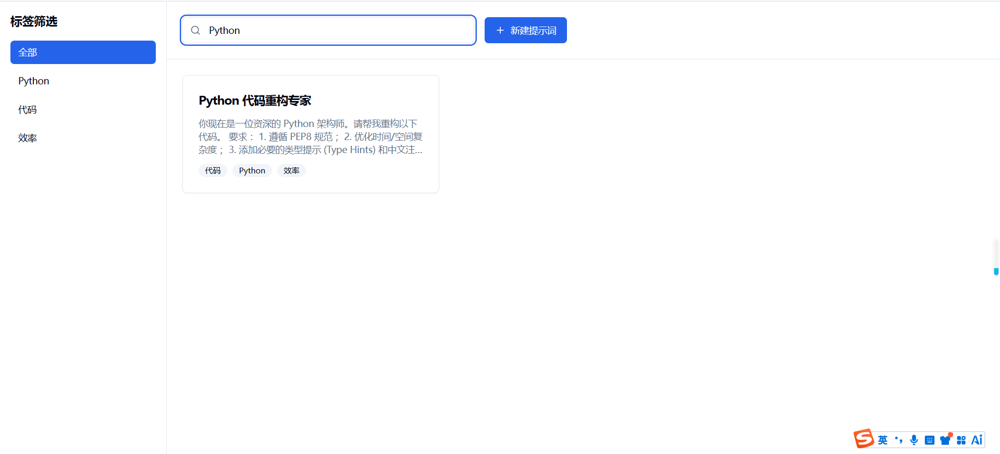 |

### 标签与分类

| 标签筛选 | 新建分类 | 分类目录 |
|:---:|:---:|:---:|
| 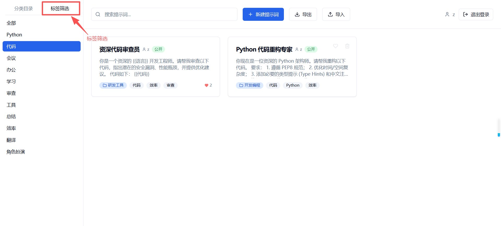 | 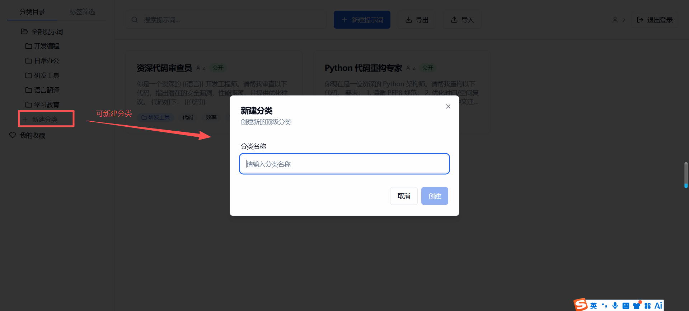 | 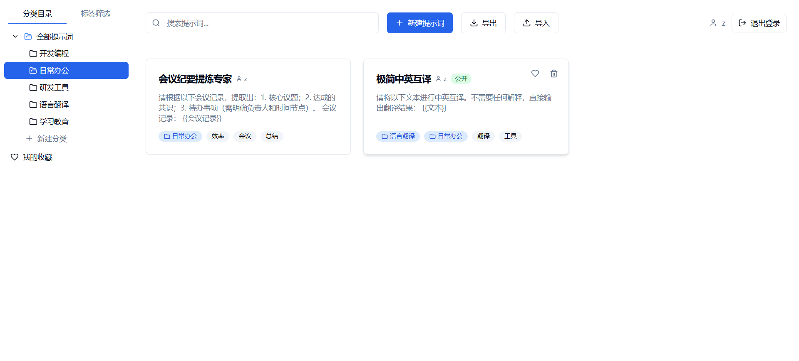 |

### 收藏功能

| 收藏功能 | 我的收藏 |
|:---:|:---:|
| 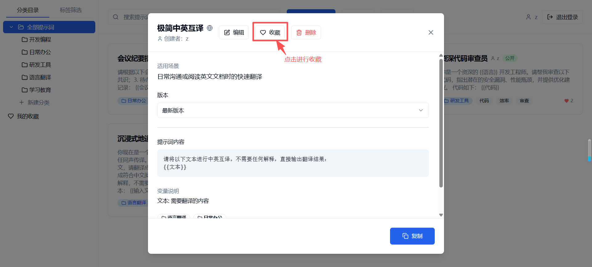 | 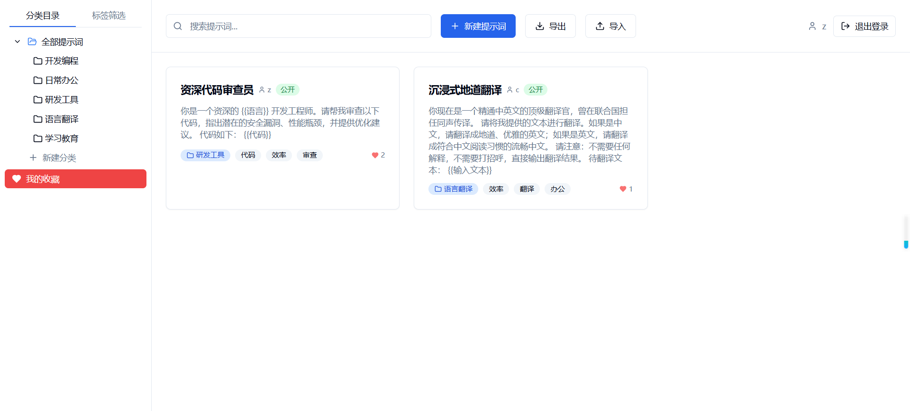 |

### 批量导入/导出

| 批量导入 | 批量导出 |
|:---:|:---:|
| 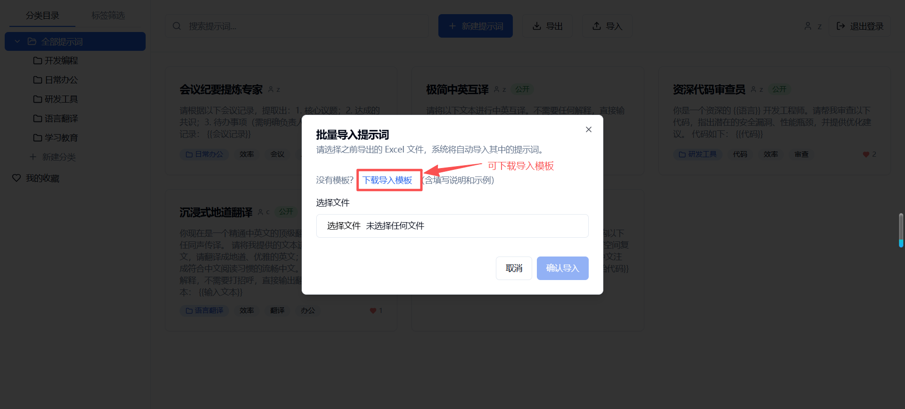 | 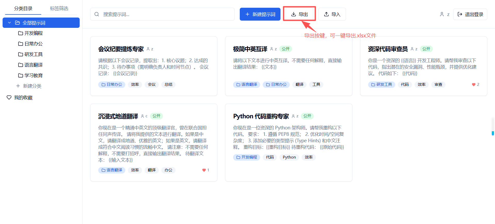 |

### 分享功能

| 创建分享链接 | 提示词分享界面 | 分享功能 |
|:---:|:---:|:---:|
| 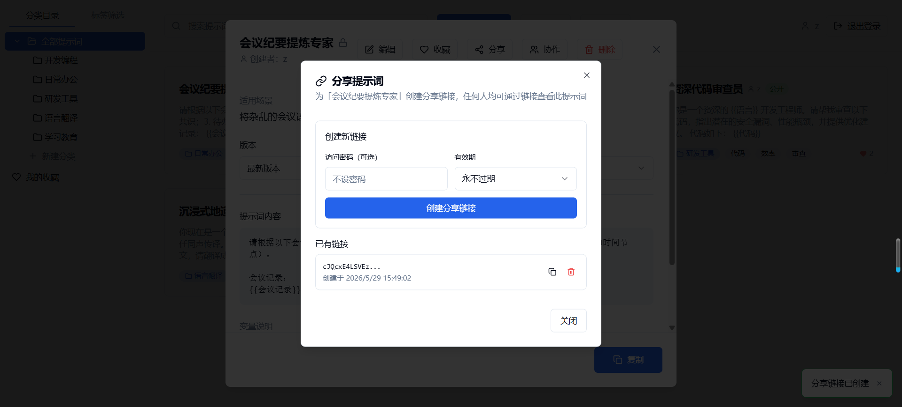 | 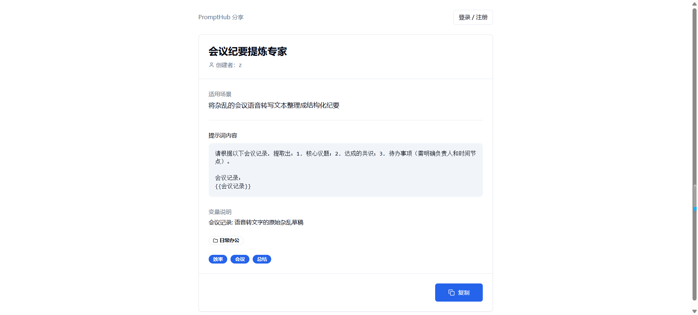 | 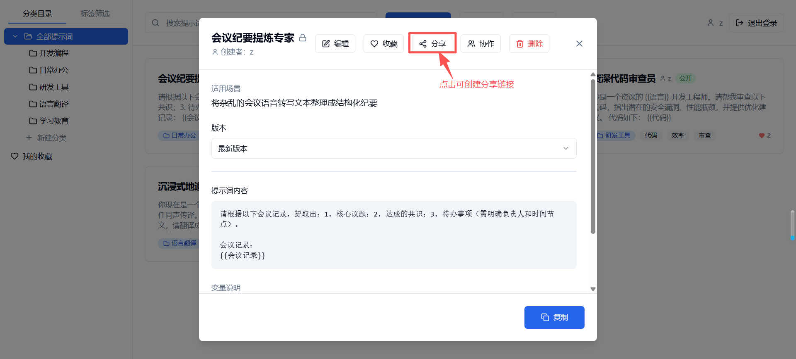 |

### 协作功能

| 协作功能 | 协作管理界面 |
|:---:|:---:|
| 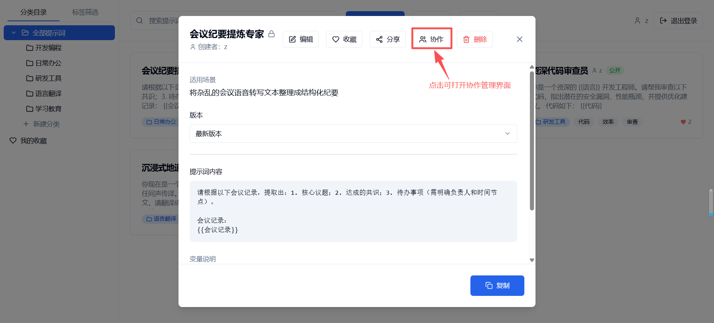 | 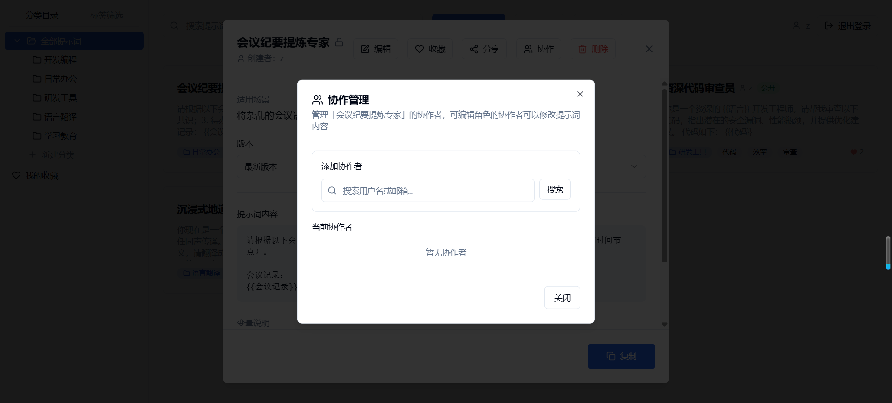 |

## 快速开始

### 环境要求

| 工具    | 最低版本 |
| ------- | -------- |
| Python  | 3.12+    |
| Node.js | 20+      |
| npm     | 9+       |

### 1. 克隆项目

```bash
git clone <仓库地址>
cd PromptHub
```

### 2. 启动后端

```bash
# 进入项目根目录
cd PromptHub

# 创建 Python 虚拟环境
python -m venv venv

# 激活虚拟环境
# Windows:
venv\Scripts\activate
# macOS / Linux:
source venv/bin/activate

# 在虚拟环境中安装 Python 依赖
pip install -r requirements.txt

# 设置 JWT 密钥环境变量（必须）
# Windows PowerShell:
$env:SECRET_KEY="your-secret-key-here"
# macOS / Linux:
export SECRET_KEY="your-secret-key-here"

# 启动后端开发服务器（支持热重载）
uvicorn backend.main:app --reload
```

> 激活虚拟环境后，终端提示符前会出现 `(venv)` 标识。后续每次开发前都需要先激活虚拟环境。

后端默认运行在 http://localhost:8000

- API 交互文档（Swagger UI）：http://localhost:8000/docs
- API 数据文档（ReDoc）：http://localhost:8000/redoc
- 首次启动时自动创建 SQLite 数据库文件 `prompts.db`

如需退出虚拟环境：

```bash
deactivate
```

### 3. 启动前端

```bash
# 进入前端目录
cd frontend

# 安装 npm 依赖
npm install

# 启动前端开发服务器
npm run dev
```

前端默认运行在 http://localhost:5173 ，打开浏览器访问即可使用。

> 前端通过 `VITE_API_BASE` 环境变量配置 API 地址，默认为 `http://localhost:8000/api`。请确保后端已启动。

### 4. 构建前端生产版本

```bash
cd frontend

# 类型检查 + 构建
npm run build

# 本地预览构建产物
npm run preview
```

构建产物输出到 `frontend/dist/` 目录。

## Docker 部署

### 使用 Docker Compose 一键启动

```bash
# 设置 JWT 密钥（必须）
export SECRET_KEY="your-secret-key-here"

# 启动所有服务
docker compose up -d

# 查看日志
docker compose logs -f

# 停止服务
docker compose down
```

启动后访问 http://localhost:5173 即可使用。

### 服务说明

| 服务     | 端口  | 说明                                         |
| -------- | ----- | -------------------------------------------- |
| frontend | 5173  | Nginx 静态服务 + API 反向代理                |
| backend  | 8000  | FastAPI 后端（仅内部暴露，通过 Nginx 代理）  |

### 环境变量

| 变量名          | 默认值                          | 说明                          |
| --------------- | ------------------------------- | ----------------------------- |
| SECRET_KEY      | -                               | JWT 签名密钥（**必须设置**）  |
| DATABASE_URL    | `sqlite:////app/prompts.db`     | 数据库连接字符串              |
| VITE_API_BASE   | `http://localhost:8000/api`     | 前端 API 基础路径             |

> Docker 部署时 `VITE_API_BASE` 应设为 `/api`，由 Nginx 反向代理到后端。

### 数据持久化

SQLite 数据库文件通过 Docker Volume 挂载到宿主机 `./prompts.db`，数据不会因容器重启而丢失。

## API 接口文档

基础路径：`http://localhost:8000/api`

> 除注册、登录、密码重置、获取标签和访问分享链接外，所有接口均需在请求头中携带 `Authorization: Bearer <token>`。

### 认证接口

| 方法 | 路径                              | 说明                   | 认证 |
| ---- | --------------------------------- | ---------------------- | ---- |
| POST | `/api/auth/register`              | 用户注册               | 否   |
| POST | `/api/auth/login`                 | 用户登录→JWT           | 否   |
| POST | `/api/auth/refresh`               | 刷新 Access Token      | 否   |
| GET  | `/api/auth/me`                    | 获取当前用户           | 是   |
| POST | `/api/auth/password-reset-request`| 请求密码重置令牌       | 否   |
| POST | `/api/auth/password-reset`        | 重置密码               | 否   |

#### 用户注册

```
POST /api/auth/register
```

请求体：

```json
{
  "username": "zhangsan",
  "email": "zhangsan@example.com",
  "password": "your_password"
}
```

#### 用户登录

```
POST /api/auth/login
```

请求体：

```json
{
  "email": "zhangsan@example.com",
  "password": "your_password"
}
```

响应体：

```json
{
  "access_token": "eyJhbGciOiJIUzI1NiIsInR5cCI6IkpXVCJ9...",
  "refresh_token": "eyJhbGciOiJIUzI1NiIsInR5cCI6IkpXVCJ9...",
  "token_type": "bearer"
}
```

> Access Token 有效期 60 分钟，Refresh Token 有效期 7 天。Token 中包含 `type` 字段区分令牌类型（access/refresh/reset）。

#### 刷新令牌

```
POST /api/auth/refresh
```

请求体：

```json
{
  "refresh_token": "eyJhbGciOiJIUzI1NiIsInR5cCI6IkpXVCJ9..."
}
```

响应体与登录接口相同，返回新的 Access Token 和 Refresh Token。

#### 请求密码重置

```
POST /api/auth/password-reset-request
```

请求体：

```json
{
  "email": "zhangsan@example.com"
}
```

响应体：

```json
{
  "reset_token": "eyJhbGciOiJIUzI1NiIsInR5cCI6IkpXVCJ9...",
  "message": "重置令牌已生成"
}
```

> 重置令牌有效期 30 分钟。生产环境应通过邮件发送，当前版本直接在响应中返回。

#### 重置密码

```
POST /api/auth/password-reset
```

请求体：

```json
{
  "token": "eyJhbGciOiJIUzI1NiIsInR5cCI6IkpXVCJ9...",
  "new_password": "new_password_123"
}
```

### 提示词接口

> 以下接口均需要认证

| 方法   | 路径                              | 说明                       |
| ------ | --------------------------------- | -------------------------- |
| GET    | `/api/prompts`                    | 提示词列表（分页/搜索/筛选/排序） |
| POST   | `/api/prompts`                    | 创建提示词                 |
| GET    | `/api/prompts/{id}`               | 提示词详情（含版本历史）   |
| PUT    | `/api/prompts/{id}`               | 更新提示词                 |
| DELETE | `/api/prompts/{id}`               | 删除提示词                 |
| POST   | `/api/prompts/{id}/favorite`      | 切换收藏                   |
| GET    | `/api/prompts/export`             | 导出提示词为 Excel         |
| GET    | `/api/prompts/import-template`    | 下载 Excel 导入模板        |
| POST   | `/api/prompts/import`             | 从 Excel 批量导入提示词    |

#### 获取提示词列表

```
GET /api/prompts
```

返回当前用户的私有提示词 + 协作提示词 + 所有公开提示词。

| 查询参数        | 类型    | 必填 | 说明                                          |
| --------------- | ------- | ---- | --------------------------------------------- |
| search          | string  | 否   | 按标题或内容模糊搜索                          |
| tag_id          | int     | 否   | 按标签 ID 筛选                                |
| category_id     | int     | 否   | 按分类 ID 筛选（包含所有子分类）              |
| favorites_only  | bool    | 否   | 仅返回收藏的提示词                            |
| page            | int     | 否   | 页码，从 1 开始                               |
| page_size       | int     | 否   | 每页数量，最大 100，默认 20                   |
| skip            | int     | 否   | 跳过的记录数（与 page 二选一）                |
| limit           | int     | 否   | 返回的记录数，最大 100                        |
| sort_by         | string  | 否   | 排序字段：created_at / updated_at / title / id |
| sort_order      | string  | 否   | 排序方向：asc / desc                          |

分页信息通过响应头返回：`X-Total-Count`、`X-Page`、`X-Page-Size`、`X-Total-Pages`

#### 创建提示词

```
POST /api/prompts
```

请求体：

```json
{
  "title": "代码审查助手",
  "scenario": "代码审查场景",
  "content": "你是一个专业的代码审查员，请审查以下{{language}}代码：\n{{code}}",
  "variables": "language: 编程语言\ncode: 待审查代码",
  "is_public": false,
  "category_ids": [1, 2],
  "tag_ids": [3, 4],
  "new_tags": ["新标签"]
}
```

#### 更新提示词

```
PUT /api/prompts/{prompt_id}
```

所有者和 editor 角色协作者可更新，否则返回 403。所有字段可选，仅传需要更新的字段。

> 当 `content` 字段发生变更时，系统自动创建一个新版本记录。

### 分享链接接口

| 方法   | 路径                                    | 说明                   | 认证 |
| ------ | --------------------------------------- | ---------------------- | ---- |
| POST   | `/api/prompts/{id}/shares`              | 创建分享链接           | 是   |
| GET    | `/api/prompts/{id}/shares`              | 获取分享链接列表       | 是   |
| DELETE | `/api/prompts/{id}/shares/{share_id}`   | 删除分享链接           | 是   |
| GET    | `/api/shared/{token}`                   | 访问分享的提示词       | 否   |

#### 创建分享链接

```
POST /api/prompts/{prompt_id}/shares
```

仅所有者可创建。请求体：

```json
{
  "password": "optional_access_password",
  "expires_hours": 24
}
```

| 字段           | 类型   | 必填 | 说明                       |
| -------------- | ------ | ---- | -------------------------- |
| password       | string | 否   | 访问密码，不设则无需密码   |
| expires_hours  | int    | 否   | 过期时间（小时），不设则永不过期 |

响应体：

```json
{
  "id": 1,
  "prompt_id": 5,
  "token": "a1b2c3d4e5f6...",
  "has_password": true,
  "expires_at": "2026-05-28T10:00:00",
  "created_by": 1,
  "created_at": "2026-05-27T10:00:00"
}
```

#### 访问分享的提示词

```
GET /api/shared/{token}
```

无需认证。如有密码保护，通过 `?password=xxx` 传递。

- 链接无效返回 404
- 链接已过期返回 410
- 密码错误返回 403

### 协作者接口

> 以下接口均需要认证

| 方法   | 路径                                          | 说明               |
| ------ | --------------------------------------------- | ------------------ |
| POST   | `/api/prompts/{id}/collaborators`              | 添加协作者         |
| GET    | `/api/prompts/{id}/collaborators`              | 获取协作者列表     |
| PUT    | `/api/prompts/{id}/collaborators/{user_id}`    | 修改协作者角色     |
| DELETE | `/api/prompts/{id}/collaborators/{user_id}`    | 移除协作者         |

#### 添加协作者

```
POST /api/prompts/{prompt_id}/collaborators
```

仅所有者可添加。请求体：

```json
{
  "user_id": 2,
  "role": "editor"
}
```

| 字段    | 类型   | 必填 | 说明                           |
| ------- | ------ | ---- | ------------------------------ |
| user_id | int    | 是   | 被添加的用户 ID                |
| role    | string | 是   | 角色：`viewer`（只读）或 `editor`（可编辑） |

#### 修改协作者角色

```
PUT /api/prompts/{prompt_id}/collaborators/{user_id}
```

仅所有者可修改。请求体：

```json
{
  "role": "editor"
}
```

#### 移除协作者

```
DELETE /api/prompts/{prompt_id}/collaborators/{user_id}
```

所有者可移除任意协作者，协作者可移除自己（退出协作）。

### 用户搜索接口

| 方法 | 路径                    | 说明               | 认证 |
| ---- | ----------------------- | ------------------ | ---- |
| GET  | `/api/users/search`     | 按用户名/邮箱搜索  | 是   |

```
GET /api/users/search?q=zhang
```

返回最多 10 个匹配的用户列表（排除当前用户）。

### 标签接口

| 方法 | 路径          | 说明     | 认证 |
| ---- | ------------- | -------- | ---- |
| GET  | `/api/tags`   | 标签列表 | 否   |

### 分类接口

> 以下接口均需要认证

| 方法   | 路径                    | 说明                               |
| ------ | ----------------------- | ---------------------------------- |
| GET    | `/api/categories`       | 分类列表（树形结构，含外部分类）   |
| POST   | `/api/categories`       | 创建分类（支持 parent_id 嵌套）    |
| PUT    | `/api/categories/{id}`  | 更新分类（防循环引用校验）         |
| DELETE | `/api/categories/{id}`  | 删除分类（子分类提升一级）         |

#### 获取分类列表

```
GET /api/categories
```

返回当前用户的私有分类 + 全局分类 + 公开提示词关联的外部分类（标记 `is_foreign: true`），以树形结构组织。

#### 创建分类

```
POST /api/categories
```

请求体：

```json
{
  "name": "开发工具",
  "parent_id": null,
  "sort_order": 0
}
```

#### 删除分类

```
DELETE /api/categories/{category_id}
```

删除分类时，其子分类的 `parent_id` 自动设为被删分类的 `parent_id`（提升一级）。

## 数据模型

### User（用户）

| 字段            | 类型        | 必填 | 说明                       |
| --------------- | ----------- | ---- | -------------------------- |
| id              | Integer     | 自增 | 主键                       |
| username        | String(100) | 是   | 用户名（唯一）             |
| email           | String(255) | 是   | 邮箱（唯一）               |
| hashed_password | String(255) | 是   | bcrypt 加密后的密码        |
| created_at      | DateTime    | 自动 | 创建时间                   |

### Prompt（提示词）

| 字段             | 类型                  | 必填 | 说明                           |
| ---------------- | --------------------- | ---- | ------------------------------ |
| id               | Integer               | 自增 | 主键                           |
| title            | String(255)           | 是   | 提示词名称                     |
| scenario         | String(255)           | 否   | 适用场景描述                   |
| content          | Text                  | 是   | 提示词正文内容                 |
| variables        | Text                  | 否   | 变量说明文本                   |
| user_id          | Integer               | 否   | 创建者 ID（外键 → users.id）   |
| is_public        | Boolean               | 否   | 是否公开到团队，默认 false     |
| created_at       | DateTime              | 自动 | 创建时间                       |
| updated_at       | DateTime              | 自动 | 最后更新时间                   |
| owner            | User                  | -    | 创建者对象（多对一）           |
| owner_username   | String                | -    | 创建者用户名（hybrid property）|
| categories       | List[Category]        | -    | 关联的分类列表（多对多）       |
| tags             | List[Tag]             | -    | 关联的标签列表（多对多）       |
| versions         | List[PromptVersion]   | -    | 历史版本列表（一对多）         |
| favorite_count   | int                   | -    | 收藏人数（动态计算字段）       |
| is_favorited     | bool                  | -    | 当前用户是否已收藏（动态计算） |
| collaborator_role| String                | -    | 当前用户的协作角色（动态计算） |
| shared_links     | List[SharedLink]      | -    | 分享链接列表（一对多）         |
| collaborators    | List[PromptCollaborator] | - | 协作者列表（一对多）          |

### Category（分类）

| 字段           | 类型              | 必填 | 说明                                |
| -------------- | ----------------- | ---- | ----------------------------------- |
| id             | Integer           | 自增 | 主键                                |
| name           | String(100)       | 是   | 分类名称                            |
| parent_id      | Integer           | 否   | 父分类 ID（外键 → categories.id）   |
| user_id        | Integer           | 否   | 创建者 ID（null 表示全局分类）      |
| sort_order     | Integer           | 否   | 排序序号，默认 0                    |
| created_at     | DateTime          | 自动 | 创建时间                            |
| owner_username | String            | -    | 外部分类的所有者用户名（动态附加）  |
| is_foreign     | bool              | -    | 是否为外部分类（动态附加）          |
| children       | List[Category]    | -    | 子分类列表（自引用一对多）          |

### Tag（标签）

| 字段 | 类型        | 必填 | 说明               |
| ---- | ----------- | ---- | ------------------ |
| id   | Integer     | 自增 | 主键               |
| name | String(100) | 是   | 标签名称（唯一）   |

### Favorite（收藏）

| 字段       | 类型     | 必填 | 说明                      |
| ---------- | -------- | ---- | ------------------------- |
| id         | Integer  | 自增 | 主键                      |
| user_id    | Integer  | 是   | 用户 ID（外键 → users.id）|
| prompt_id  | Integer  | 是   | 提示词 ID（外键 → prompts.id） |
| created_at | DateTime | 自动 | 收藏时间                  |

### PromptVersion（提示词版本）

| 字段           | 类型     | 必填 | 说明                     |
| -------------- | -------- | ---- | ------------------------ |
| id             | Integer  | 自增 | 主键                     |
| prompt_id      | Integer  | 是   | 所属提示词 ID（外键）    |
| content        | Text     | 是   | 该版本的提示词内容快照   |
| version_number | Integer  | 是   | 版本号（递增）           |
| created_at     | DateTime | 自动 | 版本创建时间             |

### SharedLink（分享链接）

| 字段        | 类型          | 必填 | 说明                                |
| ----------- | ------------- | ---- | ----------------------------------- |
| id          | Integer       | 自增 | 主键                                |
| prompt_id   | Integer       | 是   | 关联的提示词 ID（外键）             |
| token       | String(64)    | 是   | 分享 Token（URL-Safe 随机生成，唯一）|
| password    | String(255)   | 否   | 访问密码（bcrypt 哈希存储）         |
| expires_at  | DateTime      | 否   | 过期时间，null 表示永不过期         |
| created_by  | Integer       | 是   | 创建者 ID（外键 → users.id）        |
| created_at  | DateTime      | 自动 | 创建时间                            |

### PromptCollaborator（协作者）

| 字段       | 类型        | 必填 | 说明                                    |
| ---------- | ----------- | ---- | --------------------------------------- |
| id         | Integer     | 自增 | 主键                                    |
| prompt_id  | Integer     | 是   | 关联的提示词 ID（外键）                 |
| user_id    | Integer     | 是   | 协作用户 ID（外键 → users.id）          |
| role       | String(20)  | 是   | 角色：`viewer`（只读）或 `editor`（可编辑），默认 viewer |
| created_at | DateTime    | 自动 | 创建时间                                |

### 表关系

- **User → Prompt**：一对多，`user_id`，SET NULL on delete
- **Prompt ↔ Tag**：多对多，`prompt_tag_association`，CASCADE on delete
- **Prompt ↔ Category**：多对多，`prompt_category_association`，CASCADE on delete
- **Prompt → PromptVersion**：一对多，CASCADE on delete
- **User ↔ Prompt**：多对多收藏，`Favorite` 表，CASCADE on delete
- **Category ↔ Category**：自引用，`parent_id`，CASCADE on delete
- **Prompt → SharedLink**：一对多，CASCADE on delete
- **Prompt → PromptCollaborator**：一对多，CASCADE on delete

## 前端组件说明

| 组件                  | 文件                         | 说明                                                         |
| --------------------- | ---------------------------- | ------------------------------------------------------------ |
| App                   | `App.tsx`                    | 根组件，配置路由和认证守卫（ProtectedRoute / AuthRoute）     |
| Layout                | `Layout.tsx`                 | 主布局容器，编排子组件                                       |
| Header                | `Header.tsx`                 | 顶部导航栏，搜索/新建/导入导出/用户信息                     |
| Sidebar               | `Sidebar.tsx`                | 左侧边栏，分类树、标签筛选、收藏切换                        |
| PromptGrid            | `PromptGrid.tsx`             | 提示词卡片网格展示                                           |
| PromptCard            | `PromptCard.tsx`             | 提示词卡片，展示标题、摘要、标签、分类、收藏、公开标记、协作角色 |
| PromptForm            | `PromptForm.tsx`             | 新建/编辑提示词弹窗表单，含分类多选、标签选择、公开选项      |
| PromptDetail          | `PromptDetail.tsx`           | 提示词详情弹窗，含版本切换、变量填充、复制、分享、协作管理   |
| CategoryDialog        | `CategoryDialog.tsx`         | 分类创建/编辑对话框                                          |
| DeleteCategoryDialog  | `DeleteCategoryDialog.tsx`   | 删除分类确认对话框                                           |
| DeletePromptDialog    | `DeletePromptDialog.tsx`     | 删除提示词确认对话框                                         |
| ImportDialog          | `ImportDialog.tsx`           | Excel 导入对话框                                             |
| ShareDialog           | `ShareDialog.tsx`            | 分享链接管理对话框（创建/查看/删除链接）                     |
| CollaboratorDialog    | `CollaboratorDialog.tsx`     | 协作者管理对话框（搜索用户/添加/修改角色/移除）              |
| LoginPage             | `pages/LoginPage.tsx`        | 登录页面                                                     |
| RegisterPage          | `pages/RegisterPage.tsx`     | 注册页面，注册成功后自动登录                                 |
| ForgotPasswordPage    | `pages/ForgotPasswordPage.tsx` | 忘记密码页面，请求重置令牌                                 |
| ResetPasswordPage     | `pages/ResetPasswordPage.tsx`   | 重置密码页面，设置新密码                                  |
| SharedPromptPage      | `pages/SharedPromptPage.tsx`    | 分享提示词访问页面（免登录，支持密码保护）                |
| AuthContext           | `contexts/AuthContext.tsx`    | 认证上下文，管理用户状态、Token、刷新令牌、登录/登出       |
| useApi                | `hooks/useApi.ts`            | API 调用 Hook，自动注入 Token，处理 401 自动登出            |
| ui/*                  | `ui/*.tsx`                   | shadcn/ui 基础组件                                           |

## 开发指南

### 后端开发

- **路由定义**：全部 API 路由定义在 `backend/main.py` 中（`routers/` 目录为早期拆分残留，未使用）
- **认证模块**：`backend/auth.py` 提供 Access Token / Refresh Token / Reset Token 生成与验证、密码哈希/校验
- **Token 类型**：JWT 中包含 `type` 字段，值为 `access`（60 分钟）、`refresh`（7 天）、`reset`（30 分钟）
- **数据模型**：使用 SQLAlchemy 2.0 声明式映射（`Mapped` + `mapped_column`），`hybrid_property` 实现计算属性
- **数据校验**：使用 Pydantic v2 模型（`model_dump` 替代 `dict()`，`from_attributes = True`）
- **权限校验**：通过 `Depends(get_current_user)` 注入当前用户，API 内部校验 `user_id`、`is_public`、协作者角色
- **动态字段**：`favorite_count`、`is_favorited` 通过 `attach_favorite_info()` 附加；`collaborator_role` 通过 `attach_collaborator_role()` 附加
- **分享密码**：分享链接的访问密码使用独立的 `CryptContext` 实例进行 bcrypt 哈希
- **数据库**：默认使用 SQLite，连接配置在 `backend/database.py`，首次启动自动建表
- **CORS**：开发模式下允许所有来源跨域，暴露分页响应头

常用命令：

```bash
uvicorn backend.main:app --reload    # 启动开发服务器
ruff check backend/                  # Lint 检查
ruff format backend/                 # 格式化
pytest                               # 运行后端测试
```

### 前端开发

- **路由守卫**：`ProtectedRoute` 包裹需登录的页面，`AuthRoute` 包裹登录/注册/密码重置页面
- **公开路由**：`/shared/:token` 无需认证，任何人可通过分享链接访问
- **路径别名**：`@/` 映射到 `src/` 目录
- **样式方案**：Tailwind CSS + CSS 变量主题（支持亮色/暗色模式）
- **组件规范**：UI 基础组件在 `components/ui/`，业务组件在 `components/`，页面在 `pages/`
- **状态管理**：认证状态通过 `AuthContext` 全局管理（含刷新令牌），API 调用通过 `useApi` Hook 统一处理
- **API 调用**：底层封装在 `api.ts`，`useApi` Hook 自动注入 Token 并处理 401 登出逻辑
- **令牌刷新**：AuthContext 提供 `updateTokens()` 方法，配合 `refreshToken()` API 实现无感刷新
- **环境变量**：`VITE_API_BASE` 配置 API 基础路径，通过 `import.meta.env` 读取

常用命令：

```bash
cd frontend
npm run dev          # 启动开发服务器
npm run build        # 类型检查 + 生产构建
npm run lint         # ESLint 检查
npm run test         # 运行前端测试
npm run test:watch   # 监听模式运行测试
```

### 依赖版本

**Python 依赖** (`requirements.txt`)：

```
fastapi==0.104.1
uvicorn[standard]==0.24.0
sqlalchemy==2.0.39
pydantic==2.10.3
python-multipart==0.0.6
passlib[bcrypt]==1.7.4
python-jose[cryptography]==3.3.0
openpyxl==3.1.5
```

**Node.js 主要依赖**：

```
react: ^18.2.0
react-router-dom: ^7.15.0
@radix-ui/react-dialog: ^1.0.5
@radix-ui/react-select: ^2.0.0
lucide-react: ^0.344.0
tailwindcss: ^3.4.1
vite: ^5.1.0
typescript: ^5.2.2
vitest: ^4.1.7
@testing-library/react: ^16.3.2
```

## 测试

### 后端测试

使用 pytest + FastAPI TestClient，测试数据库使用独立的 SQLite 文件。

```bash
# 运行所有后端测试
pytest

# 运行指定测试文件
pytest tests/test_auth.py
pytest tests/test_prompts.py
pytest tests/test_categories.py
pytest tests/test_favorites.py
pytest tests/test_password_reset.py
```

测试 fixtures（`tests/conftest.py`）：

| Fixture              | 说明                               |
| -------------------- | ---------------------------------- |
| `client`             | 未认证的测试客户端                 |
| `auth_client`        | 已认证的测试客户端（自动注入 JWT） |
| `test_user`          | 预创建的测试用户                   |
| `second_user`        | 第二个测试用户（用于权限测试）     |
| `second_auth_client` | 第二个已认证客户端（权限测试用）   |
| `test_user_token`    | 测试用户的 JWT Token               |
| `second_user_token`  | 第二个测试用户的 JWT Token         |
| `db_session`         | 测试数据库会话                     |

### 前端测试

使用 Vitest + Testing Library + jsdom。

```bash
cd frontend

# 运行所有前端测试
npm run test

# 监听模式
npm run test:watch
```

测试文件位于 `frontend/src/test/`：
- `api.test.ts` — API 调用函数测试
- `AuthContext.test.tsx` — 认证上下文测试
- `PromptForm.test.tsx` — 提示词表单组件测试

## CI/CD

项目使用 GitHub Actions 实现自动化 CI/CD，配置文件为 `.github/workflows/ci-cd.yml`。

### 流水线阶段

```
Backend Lint → Frontend Lint → Frontend Build → Docker Build & Push → Deploy
```

| 阶段              | 触发条件                     | 说明                              |
| ----------------- | ---------------------------- | --------------------------------- |
| Backend Lint      | 所有 push/PR                 | Ruff check + Ruff format check    |
| Frontend Lint     | 所有 push/PR                 | ESLint 检查                       |
| Frontend Build    | Frontend Lint 通过后         | tsc + vite build，上传构建产物    |
| Docker Build      | main 分支 push 且 Lint 通过  | 构建并推送前后端 Docker 镜像      |
| Deploy            | main 分支 Docker 构建成功后  | SSH 部署到服务器，docker compose  |

### 所需 Secrets

在 GitHub 仓库 Settings → Secrets 中配置：

| Secret            | 说明                  |
| ----------------- | --------------------- |
| DOCKER_USERNAME   | Docker Hub 用户名     |
| DOCKER_PASSWORD   | Docker Hub 密码/Token |
| DEPLOY_HOST       | 部署服务器地址        |
| DEPLOY_USER       | 部署服务器用户名      |
| DEPLOY_SSH_KEY    | SSH 私钥              |
| DEPLOY_PATH       | 部署目录路径          |

### 分支策略

- `main` — 生产分支，push 自动触发完整 CI/CD 流水线（含部署）
- `develop` — 开发分支，push 仅触发 Lint + Build 检查
